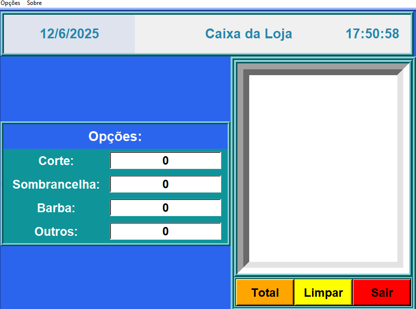
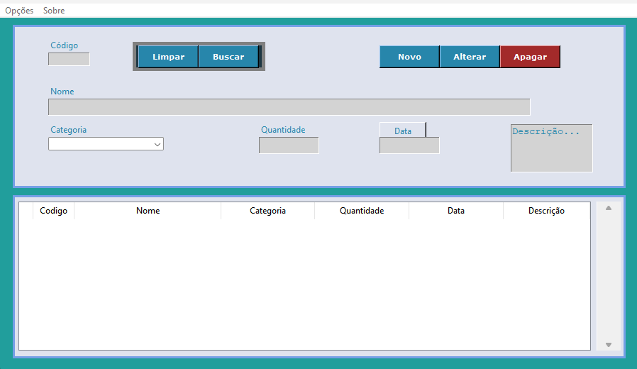

## 💈 Sistema de Caixa para Barbearia (Python + Tkinter)

Este é um projeto simples, mas funcional, desenvolvido em **Python puro**, utilizando bibliotecas como **Tkinter**, **pygame**, com o objetivo de gerenciar um caixa, cadastro de clientes e geração de relatórios em PDF. Ideal como projeto de aprendizado ou para uso em pequenos negócios.

---

### 🖼️ Capturas de Tela

| Tela do Caixa              | Tela de Clientes                 |
| -------------------------- | -------------------------------- |
|  |  |

---

### ⚙️ Funcionalidades

* 📆 Exibição de data e horário em tempo real
* 🧾 Registro de serviços
* 🧍 Cadastro de clientes
* 🧾 Geração de relatórios em PDF com dados dos clientes
* 🔢 Cálculo total automático por tipo de serviço
* 🧹 Botão "Limpar" para zerar inputs

---

### 📜 Licença

Código aberto sob licença MIT. Sinta-se livre para usar, estudar, modificar e melhorar.

---

## 📬 Contato 
- LinkedIn: [Edésio Rodrigues](https://www.linkedin.com/in/devedesio-rodrigues/)
